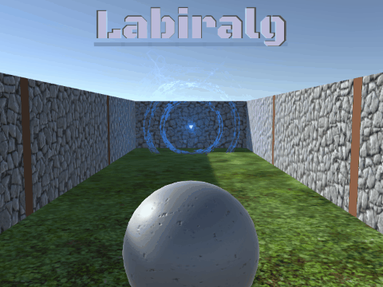

  

  Procedurally generated maze game.
   
   
  <a href="https://guibdbello.itch.io/labiralg">Play Game</a>
  ·
  <a href="https://github.com/GuiBDBello/Labiralg/issues/new?labels=bug&template=bug-report---.md">Report Bug</a>
  ·
  <a href="https://github.com/GuiBDBello/Labiralg/issues/new?labels=enhancement&template=feature-request---.md">Request Feature</a>

## Table of Contents

<ol>
  <li><a href="#introduction">Introduction</a></li>
  <li><a href="#getting-started">Getting Started</a></li>
  <li><a href="#build-process">Build Process</a></li>
  <li><a href="#acknowledgments">Acknowledgments</a></li>
  <li><a href="#license">License</a></li>
</ol>

## Introduction

Labiralg is a labyrinth game in which the mazes are procedurally generated by an algorithm. Solve as many mazes as you can in a limited time and compete with your friends to see who gets the highest score.

  

### How to Play

- **WASD**: Move.
- **Spacebar**: Dash.
- **M**: Map.

Optional: You can use the buttons on the screen to play in a mobile phone.

- **Joystick**: Move.
- **Button**: Dash.
- **Map icon**: Map.

(<a href="#readme-top">back to top</a>)

## Getting Started

To get a local copy up and running follow the steps below.

### Prerequisites

1. [Unity](https://unity.com/download)

### Configuration

1. Clone repository: `git clone https://github.com/GuiBDBello/Labiralg.git`.
1. Add the project to Unity or Unity Hub: `ADD > Select the folder you just cloned`.
1. Open project.

(<a href="#readme-top">back to top</a>)

## Build Process

1. With your project opened in Unity, select `File > Build Settings...`.
1. Select the `Platform` that you wish to build for (you may have to install a build module if you don't have it already installed).
1. Select `Build` or `Build And Run`.

(<a href="#readme-top">back to top</a>)

## Acknowledgments

List of references that were useful in the making of this project:

* [Unity Roll-a-Ball Tutorial](https://learn.unity.com/project/roll-a-ball)
* [Flat Tutorials](http://flattutorials.blogspot.com/2015/02/lets-create-perfect-maze-generator.html#more)

### Assets

| Name | Type | Creator | Source |
| --- | --- | --- | --- |
| Audiowide | Font | [Astigmatic](https://fonts.google.com/?query=Astigmatic) | [Google Fonts](https://fonts.google.com/specimen/Audiowide) |
| Black Ops One | Font | [James Grieshaber](https://fonts.google.com/?query=James+Grieshaber), [Eben Sorkin](https://fonts.google.com/?query=Eben+Sorkin) | [Google Fonts](https://fonts.google.com/specimen/Black+Ops+One) |
| Monoton | Font | [Vernom Adams](https://fonts.google.com/?query=Vernon+Adams) | [Google Fonts](https://fonts.google.com/specimen/Monoton) |
| Maze | Image | [Juan Pablo Bravo](https://thenounproject.com/creator/bravo/) | [The Noun Project](https://thenounproject.com/bravo/collection/maze-labyrinth/?i=1001588#)
| Musical note | Image | [Smashicons](https://www.flaticon.com/authors/smashicons) | [Flaticon](https://www.flaticon.com/free-icon/musical-note_126493) |
| Settings | Image | [Gregor Cresnar](https://www.flaticon.com/authors/gregor-cresnar) | [Flaticon](https://www.flaticon.com/free-icon/settings_126472) |
| Speaker | Image | [Smashicons](https://www.flaticon.com/authors/smashicons) | [Flaticon](https://www.flaticon.com/free-icon/speaker_149140) |
| Speaker (mute) | Image | [Smashicons](https://www.flaticon.com/authors/smashicons) | [Flaticon](https://www.flaticon.com/free-icon/speaker_149144) |

(<a href="#readme-top">back to top</a>)

## License

Distributed under the MIT License. See [LICENSE](./LICENSE) for more information.

(<a href="#readme-top">back to top</a>)

